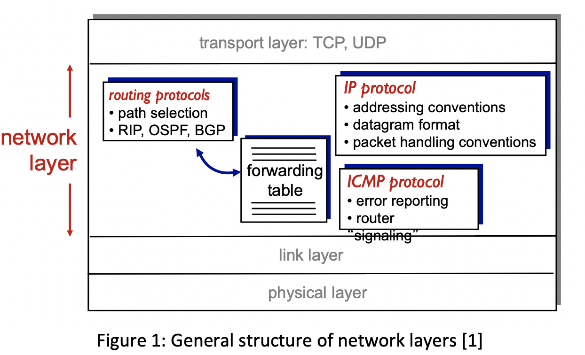

# Large-file-transmission

## 1.	Introduction:
### 1.1	Background:
Students who study
network were initially assigned with a Python project basing on knowledge of lecture 2, 3 and 4 ---- to transfer a large file whose size is at least 100 MB. As expected, students should implement it through UDP protocol segment, but students were required to propose individual specified protocol to accomplish it. 

### 1.2	Literature review:
According to rudimentary knowledge about network, there are two fundamental protocols in transport layer ---- UDP and TCP (see figure 1). In contrast to TCP which is reliable, UDP is unreliable data transfer that it may cause data loss, but it has faster and simpler connection. As a result, the student of coding this program choose rdt3.0, which has checksum to avoid loss, as blueprint for this project.

## 2.	Methodology:
### 2.1. Proposed ideas and protocols
As mentioned in previous report, rdt3.0 has been chosen as general structure to design protocol. The whole process that can be divided into following steps (see figure 2):

Yet once the initial version of protocol has completed, although it can realize base transmission, it is so slow that it limits use of physical resource. In order to increase utilization, the student use a pipelined protocol instead of stop-and-wait to operate transmission of large file of UDP segment (see figure 3). Different with stop-and-wait that the server will send only one packet each time, pipelined protocol will send three or more packets each time. Since the average time of each packet of waiting for ACK of pipelined protocol will been shorten, compared with stop-and-wait.

As a result, GBN is selected (optional) which has not finished finally. As show in figure 4, GBN will has 3 part to implement it ----base, window_size and next_seq_num.

Detail implementation of rdt3.0:
As stated in figure 2 (the FSM of sender for GBN), it will read the file as following sequence(see figure 5):
1.	It will send all packets of next_seq within window’s size, which is blue.
2.	After sending all packets within window’s size, it will not send any new packet unless receive ACK from receiver (the waiting packet is yellow, which is not ensured about whether receiver has received).
3.	When receiving ACK, the window will slide the number of ACK received.
4.	Those process will continue, while the file has been totally read.

### 2.2. Flow of event:

## 3. Implementation:
For server:
	The server will online to wait for any request for file, and know the path
Code:

message, client_address = server_socket.recvfrom(20480)  # Receive request message from client
modified_message = message.decode()

After knowing the path of the requested file, the server will send maximum 4 (window’s size limited number of file packet)
Code:

    if next_seq_num < base + window_size and not done:
        server_socket.sendto(file_segment, client_address)

        next_seq_num = next_seq_num + 1

	    The server won’t send new packet data until receive ack
Code:

    # Wait for ack
    ack, client_address = server_socket.recvfrom(20480)

    # Set the time of timeout
    server_socket.settimeout(5.0)

    # Get the result of whether message has been successfully sent
    receive_seq_num, result = check_corrupt_message(ack)

   
    if result is True:
        base = base + 1

	This process will continue to repeat until the file has been all read.
Code:

    if not data:
        done = True
    f.close()

#### For client:
##### 1. It will receive segment from server

Code:

    # Receive UDP segment
    file_segment, server_address = client_socket.recvfrom(segment_size)

##### 2. It will parse the segment to get data, checksum and other message
Code:

    # Parse the data which has been encapsulated
    file_segment_length, 
    file_segment_seq_num,
    file_segment_data, 
    file_segment_md5 = parse_file(file_segment)

##### 3. It will compare checksum and the data to ensure that data is not corrupted
Code:

    # Check checksum and resend ACK or NAK to notify server
    ack, result = check_checksum(file_segment_data, file_segment_md5,file_segment_seq_num)

##### 4. It will resend ACK or NAK
Code:
	
    # If checksum shows that segment is correct
    if result is True:
        # Write the data
        f.write(file_segment_data)
    
        # Resend ACK
        client_socket.sendto(ack, (server_name, server_port))
        end_this_pkt = True

    # If the checksum shows that segment is corrupted
    else:
        # Resend NAK
        client_socket.sendto(ack, (server_name, server_port))

##### 5. This process will continue after receiving all packets
Code:
    
    for i in tqdm(range(round_times)):
    ……..
    ……..
        f.close()

    client_socket.close()

## 5. Conclusion:
### 5.1 The work which has been done:
As mentioned, this Python project has implement large file transmission through UDP segment and imitate rdt3.0 as base blueprint. In addition, in order to improve speed, the student improve it using pipelined transmission instead of previous stop-and-wait protocol through GBN (Go-Back for N) protocol.

### 5.2 Improvement:
A wasting time part of this project is that it has to read the file firstly and then encapsulate it to segment. Secondly, the segment will handle it to send part which waste a lot of time.
Thus, it is vital to sperate reading part and sending part to two simultaneous thread.

## Reference:
[1]. COMPUTER NETWORKING: A TOPDOWN APPROACH, J. F. KUROSE AND K. W. ROSS 
